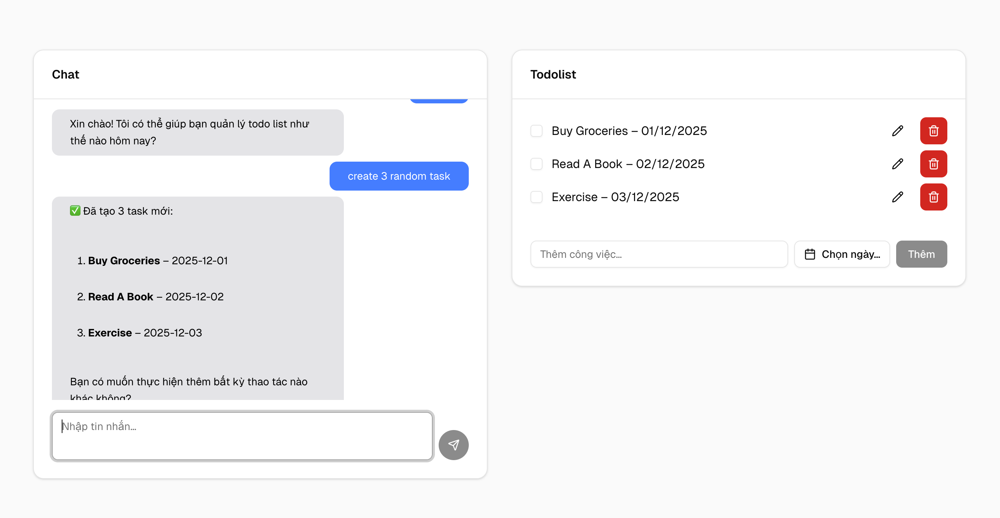

# Todolist-MCP

Todo list management application with a **microservice** architecture, consisting of:

- **UI**: Frontend built with Next.js 16
- **Server**: Backend Node.js with MCP (Model Context Protocol) integration for managing Todos

The application can be deployed via **Docker Compose** and supports environment variables from command line or `.env` files.

---

## Preview



---

## Project Structure

```
todolist-mcp/
├─ ui/           # Next.js 16 frontend
├─ server/       # Node.js backend with MCP
├─ docker-compose.yml
```

---

## Requirements

- Docker & Docker Compose
- Node.js 24.x for local development (only needed if running dev without Docker)

---

## Installation And Run

1. Clone the repository:

```bash
git clone https://github.com/dt313/todolist-mcp.git
cd todolist-mcp
```

2. Create a `.env` file in `server/`:

```
OLLAMA_API_KEY=your_ollama_api_key
PORT=3222
```

3. Create a `.env` file in `ui/`:

```
NEXT_PUBLIC_API_PORT=3222
NEXT_PUBLIC_API_LOCALHOST=localhost
```

4.

```
cd todolist-mcp

cd server
npm run dev || npm start

cd ui
npm run dev || npm run build && npm start
```

---

## Running with Docker Compose

You can run both UI and server at once:

- Get Cloud API here : https://ollama.com/settings/keys

```bash
# Pass environment variables via command line
OLLAMA_API_KEY=your_ollama_api_key SERVER_PORT=your_server_port CLIENT_PORT=your_client_port docker compose up --build
```

Or use default values if not provided:

- Server port: `3222` || `your_server_port`
- UI port: `3333`|| `your_client_port`

---

## Features

### MCP (Model Context Protocol)

- `create_todo` / `add_todo`
- `delete_todo` by id or by name
- `update_todo` by id or by name
- `delete_many_todo`
- `add_many_todo`

### REST API

- Basic CRUD operations: Create, Read, Update, Delete todos

---

## Notes

- MCP allows the server to execute various Todo actions: `get_todos`, `add_todo`, `update_todo`, `delete_todo`, `complete_todo`, and batch operations.
- When running via Docker Compose, the `OLLAMA_API_KEY` environment variable is passed directly to the server container from the command line.
- UI fetches API port from the `NEXT_PUBLIC_API_PORT` environment variable.
